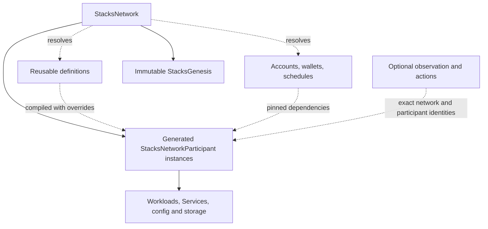

# Composable network API

The composable `v1alpha2` API is implemented by the
[network runtime](../../network-operator/public-api-foundation.md). This package
specifies its resource relationships, ownership, lifecycle and protocol boundaries.
The [generated schemas](../../../charts/stacks-network-operator/crds/) define served
validation; qualification is limited to the profiles and outcomes recorded in the
[runtime qualification record](../../network-operator/public-api-qualification.md). Examples
require compatible images and cluster placement.

## Read this package

| Document | Purpose |
| --- | --- |
| [Composition](composition.md) | Heterogeneous participants, reusable refs, inline definitions, overrides and identity. |
| [Resources](resources.md) | Public fields, generated instances, supported controls and per-kind responsibilities. |
| [Lifecycle](lifecycle.md) | Resolution, genesis freeze, updates, phases, destructive removal and disposal. |
| [Protocol timing](protocol-timing.md) | Source-derived initialization gates and qualification limits. |
| [Operators and runtime](operations.md) | Controllers, images, ownership, watches, permissions and Chaos Mesh. |
| [Implementation notes](implementation-notes.md) | Protocol module boundaries, attribution/qualification and exact generated-name formulas. |
| [Thirty-actor walkthrough](walkthrough.md) | Initial startup, late participation, live changes and fresh repetition. |
| [Baseline](examples/30-actors.yaml), [late participants](examples/late-participant.yaml), [optional capabilities](examples/optional.yaml) | Complete example inputs and explicitly scoped requests. |
| [Review ledger](review-ledger.md) / [Fable prompt](fable-prompt.md) | Review boundary, findings, verification and handoff. |

## Product contract

Install operators once, then declare networks. StacksNetwork resolves explicit
composition and maintains supported ongoing operation. Reusable definitions and
identity resources remain independent; generated participants own the network's
workloads. Ordinary regtest development, reliability/liveness/performance studies
and trusted defensive investigations are first-class uses. Actions, Chaos Mesh and
observability are optional. Operators are not scenario planners or forensic archives.

The initial profile supports direct PoX-4/PoX-5 maintenance and real sBTC prerequisites
with explicit test initialization. Delegated pools, real bridge signers and historical
PoX-1–3 participation remain separate scope. Shared keys and unusual actor combinations
are legal experiment inputs; deterministic runtime outcomes are not promised.

## Declare a network

```yaml
# Excerpt; the baseline supplies complete dependencies and genesis allocations.
apiVersion: network.stacks.org/v1alpha2
kind: StacksNetwork
metadata:
  name: network
  namespace: lab-30
spec:
  operation: Paused # Inspect before activation; default Running.
  profile: regtest-pox4-pox5-v1
  epochScheduleRef: {name: epochs}
  participants:
    - name: bitcoin-a
      kind: BitcoinNode
      definition:
        inline:
          bitcoinNode:
            peers: {discovery: Network}
    - name: miner-a
      kind: StacksNode
      definition: {ref: {name: standard-miner}}
      overrides:
        stacksNode:
          bitcoinNodeRef: {name: bitcoin-a}
          image: local/stacks:hypothesis-42
```

Participant names identify instances, not reusable definitions. The map-list supports
exactly one reference or typed inline definition per entry. Typed overrides affect
only that instance. Wiring names refer to selected participants; account, wallet and
schedule refs refer to independent CRs. Missing dependencies wait; none are implicitly
instantiated. Unselected definitions can remain parked.

Creating the root requests operation Running by default. operation Paused permits
resolution/inspection before activation; that network is Uninitialized, not Paused.
Running freezes an immutable StacksGenesis before starting protocol workloads.
The Initialized condition records completed bootstrap independently of later
Running, Paused, Stopped or Failed state. Genesis also retains the public requirements
of unfinished bootstrap gates; conflicting policy edits wait for those gates.
Root profile/epoch/genesis/defaults remain
immutable; supported instance overrides can change images/resources without editing
defaults. [Lifecycle](lifecycle.md#network-operation-and-observed-lifecycle) defines
phase precedence and transitions.

## Ownership and runtime controls



Solid edges are ownership; ordinary workload descendants keep their Kubernetes owner
chains. PVC retention is explicit. Definitions retain their own validation status;
instances expose effective policy, dependencies, workload references and observations.
The network reports lifecycle/genesis and bounded identity summaries, not every heartbeat.

Workload controls are kind-specific. Actors can suspend/restart with documented Pod
and storage effects; Stacks management workers can cooperatively pause while their
processes survive. No generic process supervisor is required. A management worker
crash fails the experiment; operator restart/watch reconnection does not replace it.
Bitcoin execution uncertainty retains its separate durable contract.

**Participant removal is destructive.** Remove its entry to delete runtime according
to cleanup/storage rules; use a new participant name for a replacement. Deleting the
network disposes all its runtime, preserving reusable definitions and keys. There is
no retirement lifecycle, destruction CRD or mandatory evidence-export gate. Optional
Loki/OTel-style collection can retain configured telemetry; export any other needed
artifacts before destructive operations. Retained PVCs are not complete forensic evidence.

One canonical network per namespace prevents overlapping roots during finalization.
A new root UID gets fresh runtime/data; parallel experiments use separate namespaces.
No historical-run registry, automatic replay or credential-distribution controller.

## Implementation boundary

The served v1alpha2 API has no in-place conversion from the retired API.
Go implements controllers, tooling and scoped protocol workers.
The network aggregate alone owns participant admission and resolution/policy
projections; domain controllers own validation reports and workload/runtime facts.
Workers use native CR list/watch and write only execution status. Shared status uses
minimal server-side apply payloads with disjoint field/condition ownership; ConfigMaps
hold configuration, not command queues.

[libs/stacks](operations.md#go-protocol-library-and-runtime-boundary) is an
independent Go module for native RPC, encoding and signing. Selective source reuse
requires attribution; Stacks.js 7.6.0 is a test-only oracle, not a runtime dependency.
AGENTS.md defines the repository's language and module boundary.

## Common vocabulary and bounds

All CRs are namespaced. Network/participant/genesis/epoch schedule use
network.stacks.org/v1alpha2; Bitcoin definitions use bitcoin.stacks.org/v1alpha2;
Stacks definitions use stacks.stacks.org/v1alpha2. Requests pin the network UID and
resolve a participant name to its UID. Definitions may be used more than once; no
runtime identity is derived solely from their UID.

Conditions carry observedGeneration, reason, message and transition time. Resolved
means inputs agree; Initialized means fixed protocol gates completed; Running describes
current operating state; [Operational](lifecycle.md#operational-condition) requires
fresh baseline progress and contract observations, not readiness of every participant.

Bounds: 100 participants per actor kind, 100 stackers, one of each singleton
maintenance kind, 1000 lifetime instance identities, 1000 accounts/allocations,
63-character DNS-label participant names, and fourteen quoted supported epochs with
nondecreasing uint32 heights (first two zero). Amounts obey supported uint64 supply
limits. Status contains summaries/refs, never keys, signed bytes or logs. The fixed
[release observation policy](operations.md#observation-policy) defines polling,
freshness, heartbeat and progress windows; it is not a per-resource tuning surface.
Coalesced status heartbeats and CR watches do not promise a latency SLA.
