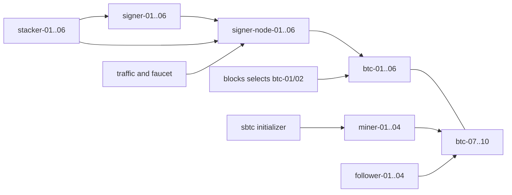

# Thirty actors and repeatable fresh runs

Status: conceptual walkthrough. No new API/runtime or multi-actor protocol
qualification is claimed. The [complete manifest](examples/30-actors.yaml) contains
76 objects: reusable declarations, their Namespace and one root requesting operation Paused.
It selects 40 participants: 30 actors, six stackers and four maintenance capabilities.
follower-04 is inline; the other entries reference reusable definitions.

## Reusable topology

| Actor participants | Count | Dependencies |
| --- | --- | --- |
| BitcoinNode btc-01 through btc-10 | 10 | Common peer network; btc-01/02 receive baseline production opportunities. |
| StacksNode miner-01 through miner-04 | 4 | Bitcoin btc-07..10, four miner accounts and BitcoinWallets. |
| StacksNode signer-node-01 through signer-node-06 | 6 | Bitcoin btc-01..06. |
| StacksNode follower-01 through follower-04 | 4 | Bitcoin btc-07..10; no mining or stacking. |
| StacksSigner signer-01 through signer-06 | 6 | Each references its numbered node and account. |
| **Protocol actors per running network** | **30** | Ten Bitcoin, fourteen Stacks nodes, six consensus signers. |

Six independent StacksStacker policies use distinct holder/admin accounts in this
example. Shared identities are allowed by the API; this baseline avoids nonce and
protocol-identity contention. The policy is separate from the consensus signer Pod.



Edges denote references/traffic, not ownerRefs. None of these definitions has a
networkRef. A running network gets 30 actor Pods, six stacker Pods, one traffic,
one faucet and one contract worker, plus ten Bitcoin control-worker Pods: **49
application Pods**. Shared operators/addons and transient resolver Jobs are extra.
All runtime objects carry the network UID. The network owns their generated participants, which
own workload roots;
Pods/ReplicaSets retain normal Kubernetes owners. Retained PVCs use labels without
a cascading ownerRef. Reusable source declarations remain user-owned.

The manifest declares 28 accounts: six holders, six administrators, six consensus
identities, four miners, contract deployer, traffic source/recipient and three bridge
public identities. Faucet owns a generated account; nine referenced non-miner node definitions
own their generated identities. The inline
follower-04 participant owns its own default identity. Total resolved account inventory
is **39**, of which 38 are reusable and one is recreated with the inline instance.

Genesis includes eighteen explicit addresses plus the faucet, for **19 allocations**
and **17012000000000000 microSTX**. Holders receive 2000000000000000 each and request
stake of 1000000000000000; administrator/miner/deployer/traffic accounts receive fee
balances. Shared key aliases never multiply supply: equal address/amount allocations
fold once, conflicting amounts are invalid. Equal requested stakes do not promise
equal observed reward slots; protocol weights remain observations.

Five BitcoinWallet definitions supply four miner descriptors and one payout identity.
BitcoinNode.walletRefs loads them on the selected nodes. Funding/maturity belongs to
each run and node view, not the reusable key. Another node could reference the same
wallet without creating a second key or requiring a wallet lease.

## Declare, inspect, freeze and run

1. Install shared operators and load/pull qualified images. Apply the baseline in
   any order. operation Paused permits independent resolution; no actor/mutation
   worker activates. Once inputs agree, phase is Uninitialized with Resolved=True.
   Omit operation or set Running for automatic startup.
2. Inspect generated StacksNetworkParticipant objects: source/inline provenance,
   effective configuration, dependency names and conditions. Correct missing inputs
   or entry overrides. Immutable root defaults need a new root if changed, but an
   image typo can be fixed through the actor override. Optionally pin inputDigest
   with expectedInputDigest before freeze. If status.genesisRef is present, genesis and
   the initial cohort are already fixed even when phase is Uninitialized: entry changes
   are late additions/destructive removals, not initial-topology corrections. Artifact
   creation is the true boundary; status publication may lag it. Recreate the root to
   change frozen inputs/cohort.
3. Set operation Running. The controller verifies current identities and creates
   StacksGenesis with 19 allocations and the initial 40 participant identities.
   Binding and genesis precede protocol activation; invalid compositions never start
   a partial initial network.
4. PrepareBitcoin reaches 203 with four miner wallets imported/funded/mature. Start
   Stacks actors and scoped workers. PoX-4 enrollments must cover cycle 12 before
   conservative ceiling 234; bounded Bitcoin opportunities permit legacy inclusion.
5. Observe the prepared cycle-12 signer set before epoch 3.0 at 252 (ceiling 251).
   Deploy real sBTC prerequisites before 4.0 at 282 (ceiling 281).
6. After PoX-5 activation hold at 284 for managers/enrollment, then observe the
   prepared cycle-15 set before releasing 299→300. Fresh canonical inclusion after
   that boundary sets Initialized=True. See [timing](protocol-timing.md).

Late invalid input affects its instance, not frozen genesis or unrelated runtime.
For example, a stacker edit changing signer A/amount X to signer B/amount Y cannot
partially adopt amount Y: RequiresReplacement preserves the old whole policy while
its dependencies remain valid. entry.control.paused still pauses it. Amount-only
updates use the documented unlock/enrollment policy after their affected bootstrap
gates complete. Before then, condition PolicyDeferred=True with reason BootstrapPending
preserves the admitted policy and the
exact requirements captured in genesis, including across controller restart.

## Pause, stop, destroy and repeat

```bash
kubectl -n lab-30 patch stacksnetwork network --type=merge \
  -p '{"spec":{"operation":"Running"}}'
kubectl -n lab-30 patch stacksnetwork network --type=merge \
  -p '{"spec":{"operation":"Paused"}}'
# Wait for acknowledgement; collect evidence while processes remain available.
kubectl -n lab-30 patch stacksnetwork network --type=merge \
  -p '{"spec":{"operation":"Running"}}'
# Optional terminal stop: collect ephemeral files/logs first; there is no resume.
kubectl -n lab-30 patch stacksnetwork network --type=merge \
  -p '{"spec":{"operation":"Stopped"}}'
# Export retained configuration/PVC contents as needed before destruction.
kubectl -n lab-30 delete stacksnetwork network --cascade=background --wait=true
kubectl apply -f docs/design/public-api/examples/30-actors.yaml
```

Root deletion can also be requested directly from Running; it performs shutdown
before destruction. These commands describe proposed APIs, not today's installed
resources. Reapplying the baseline requests operation Paused and reapplies its entire
participant list and reusable definitions. After the late JSON patch, client-side
kubectl apply of that older baseline drops the added entries: **their removal destroys
runtime and consumes their single-use names**. Keep every desired entry in the managed
manifest; use the operation-only patches above to change lifecycle without changing
membership. A baseline reapply is also rejected from terminal Stopped: delete the root first.

Server-side apply is not an automatic safeguard: omitted entries owned by the same
field manager can be removed. Separate managers may own disjoint map-list entries,
but that requires an explicit ownership workflow; do not switch apply modes as a
repair for a stale manifest. See [SSA ownership](https://kubernetes.io/docs/reference/using-api/server-side-apply/).
For Argo CD, configure PrunePropagationPolicy=background to match ordered root disposal;
its default foreground prune does not provide that guarantee. This does not prevent
destructive membership edits. See [Argo CD pruning](https://argo-cd.readthedocs.io/en/stable/user-guide/sync-options/#resources-prune-deletion-propagation-policy).
Pausing is not an atomic protocol snapshot. Stopping can lose logs/ephemeral data;
PVC retention and optional external telemetry provide only their configured coverage.

Restore baseline source specs for a like-for-like repeat. Reusable keys survive;
inline-generated keys do not. A repeat needing the same inline identity must specify
an explicit reusable accountRef. New root UID means fresh chain, instances and data.
Clear optional faults and use fresh requests. Compare exported evidence externally;
no controller replays edits or promises deterministic blocks/performance.

## Late participation and shared identities

Prepare [late-participant.yaml](examples/late-participant.yaml). Replace
${NETWORK_UID} with the current root UID before applying its two faucet requests.
The nine objects define three accounts, two requests, Bitcoin/Stacks/signer definitions
and a stacker policy. They create no actor runtime until the root selects them:

```bash
NETWORK_UID=$(kubectl -n lab-30 get stacksnetwork network -o jsonpath='{.metadata.uid}')
kubectl -n lab-30 patch stacksnetwork network --type=json --patch-file=/dev/stdin <<JSON
[
  {"op":"test","path":"/metadata/uid","value":"${NETWORK_UID}"},
  {"op":"add","path":"/spec/participants/-","value":{"name":"btc-late","kind":"BitcoinNode","definition":{"ref":{"name":"btc-late"}}}},
  {"op":"add","path":"/spec/participants/-","value":{"name":"late-signer-node","kind":"StacksNode","definition":{"ref":{"name":"late-signer-node"}}}},
  {"op":"add","path":"/spec/participants/-","value":{"name":"late-signer","kind":"StacksSigner","definition":{"ref":{"name":"late-signer"}}}},
  {"op":"add","path":"/spec/participants/-","value":{"name":"late-stacker","kind":"StacksStacker","definition":{"ref":{"name":"late-stacker"}}}}
]
JSON
```

This one-time append preserves existing entries and rejects a replacement root UID;
duplicate names are invalid. Declarative users update their complete name-keyed
participant list instead. A wiring name absent from the list is UnselectedDependency.
Faucet requests total 2001000000000000 microSTX, plus fees; the stacker waits for funds
and protocol eligibility. There are now 33 actors, 44 participants, 54 application
Pods and 43 resolved accounts. Genesis stays at 19 allocations and its original digest.
Discovery connects newcomers without rolling all peers.

**Removing these entries destroys their runtime.** First capture required evidence,
then remove the entries from the root. Storage retention controls which PVCs survive;
there is no retired participant object. Adding replacements requires new participant
names and corrected wiring to those names. Reusable definitions can be referenced
again. A previous management crash or uncertain shutdown still prevents new workers.

An intentionally shared signer/miner/holder key is legal. Each worker serializes its
own account uses; independent workers may encounter nonce or contract conflicts.
No automatic retry, account lease or duplicate-key rule hides the experiment.

## Headlamp and failure checks

Inspect definitions for reusable input validity. Inspect generated participants for
compiled configuration, pinned dependencies, lifecycle acknowledgement, endpoints,
workloads and protocol observations. Root phase/conditions summarize the network;
Initialized and Running do not imply current Operational health. OwnerRefs and
network/participant labels connect the views without runtime status on definitions.

| Event | Expected behavior |
| --- | --- |
| Remove initial participant | Destructive cleanup; unfinished gates requiring it remain blocked; completed initialization does not rewind. |
| Suspend actor | Delete its Pod through scale-down; retain PVCs, lose ephemeral data; resume restarts/resynchronizes. |
| Change actor image | Roll only that actor; verify protocol recovery separately. |
| PlacementError | Remove incorrect participant and add a new name with correct placement, or recreate network. No implicit bound-worker move. |
| Replace source/key under same name | UID/fingerprint mismatch withdraws affected admission; no silent rebinding. |
| Directly delete generated instance while desired | InstanceLost; remove entry and use a new name, never reconstruct under old identity. |
| Remove management participant | Settle supported work, terminate and delete; unknown shutdown outcomes fail the network rather than authorize a replacement. |
| Worker Pod missing after controller restart | Persisted exact bound identity makes loss Failed; no automatic replacement. |
| Stop whole network | Terminal process shutdown; definitions/config/PVCs remain for inspection, volatile evidence may not. |
| Lose node during shutdown/deletion | TerminationUnknown; do not claim stopped or permit overlapping replacement. |
| Delete network | Dispose runtime/shared records/genesis; preserve reusable definitions and keys. |
| Delete namespace | Broader deletion, including reusable objects and retained namespaced PVCs. External telemetry follows backend retention. |

## Optional components and capacity

[optional.yaml](examples/optional.yaml) is a menu, not a playbook to apply as one
experiment. Replace its `${NETWORK_UID}` placeholders with the current root UID. Actions use
proposed actions.stacks.org/v1alpha2 with immutable networkUID.
Telemetry/export need the optional operator and administrator-provided observation-store
Secret/backend, the one declared external dependency in that file. Update its sample
absolute time window. Native Chaos Mesh uses the existing qualified profile adapted
to exact network/participant UID selectors and control paths; the current profile requires
an explicit compatibility update. See [Chaos integration](operations.md#chaos-mesh-interaction).
No new fault-wrapper CRD is proposed.

The baseline workerPlacement targets stacks-k8s-control-plane; actor placements use
the two worker nodes. This makes worker location explicit, not host isolation.
This complete example specifically targets that local three-node kind cluster;
change the selectors before start elsewhere. Unschedulable workers report
PlacementError with scheduler details, rather than unexplained Pending. Node-wide chaos
must exclude the support node; all kind nodes still share the Docker host.

Actor requests total 5.3 CPU and 13.25 GiB, with up to 60 GiB actor PVC requests;
49 application Pods, shared controllers and transient Jobs need additional headroom.
These are planning inputs, not capacity evidence. The existing three-node kind cluster
still shares one host. Full epoch/cohort operation, late enrollment, pause, sequential
isolation, actor recovery and real deletion/GC need live qualification after implementation.
