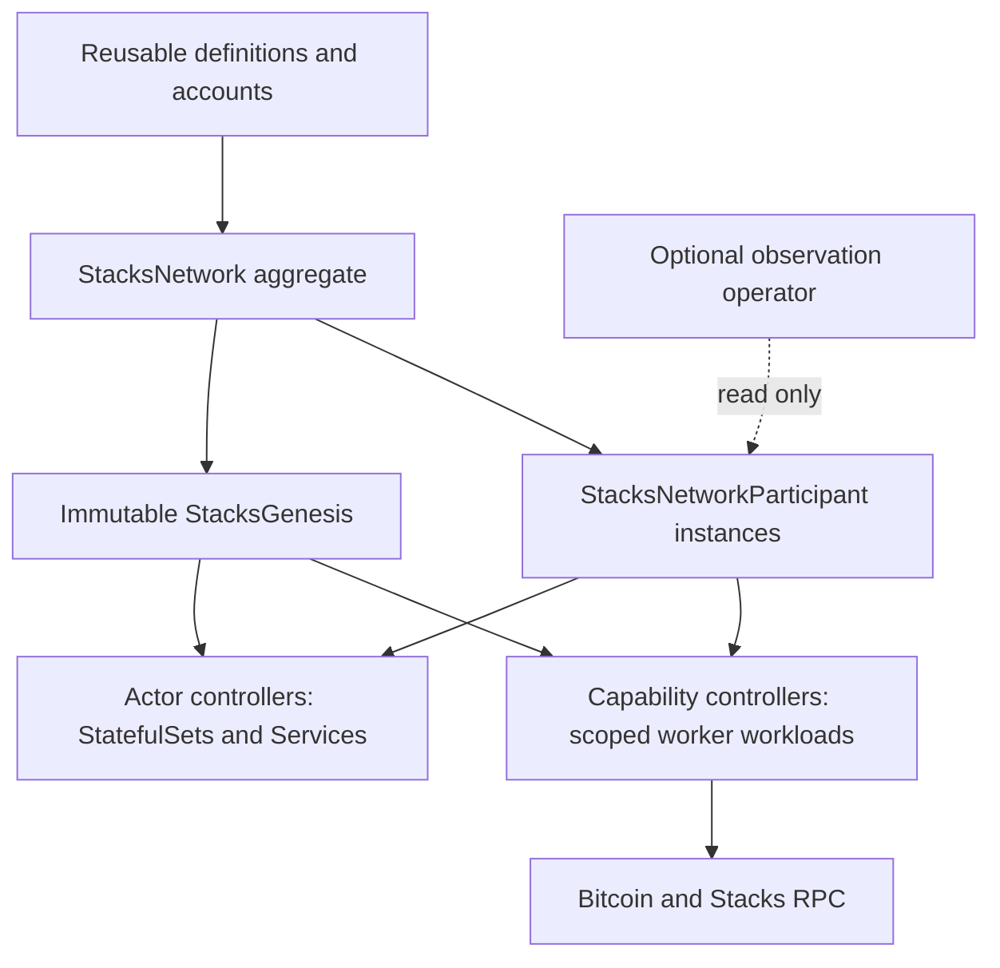

# Network operator architecture

The [public API](../design/public-api/README.md) separates reusable inputs from
network-owned runtime instances. Installing the chart starts one operator that
watches networks across namespaces; an individual network is a custom resource,
not a Helm release.

The aggregate resolves dependencies, validates topology and owns whole-policy
admission. Domain controllers own workload status. Workers own execution status;
all shared status objects use disjoint server-side-apply field ownership.
The aggregate never reads signing-key data or executes protocol mutations.

Scoped resolver Jobs generate or inspect account and configuration Secrets.
Actors mount their own immutable configuration and required keys. Consensus
signers run separately from stacker administration. Stacks management workers
are single-use Pods with exact-UID activation; Bitcoin control uses durable
execution records. Their different failure contracts are documented in the
[runtime guide](public-api-foundation.md#workloads-and-controls).

Deleting the root destroys its generated participants and runtime resources,
subject to termination, action cleanup and storage retention. Reusable accounts
and definitions survive. A new root creates new genesis and runtime identities;
retained storage is never silently attached to a new experiment.

The portable `libs/stacks` module supplies RPC, Clarity, transaction signing and
PoX primitives. It imports no Kubernetes or operator implementation. Independent
operators share API contracts, not controller code.
